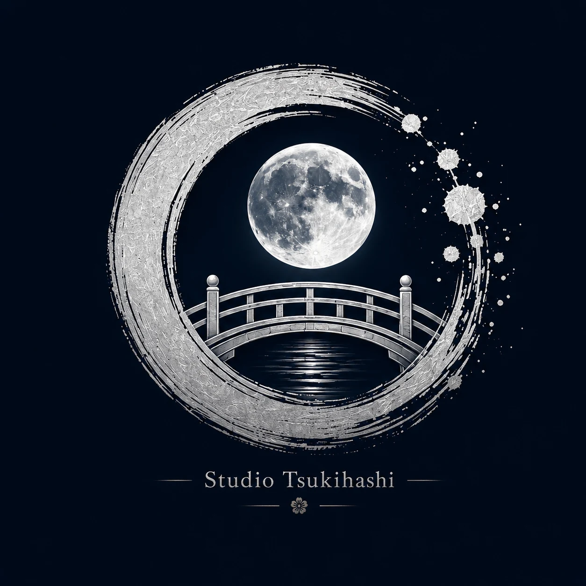

<!DOCTYPE html>
<html lang="ja">
<head>
  <meta charset="UTF-8">
  <meta name="viewport" content="width=device-width, initial-scale=1.0">
  <meta name="description" content="Studio Tsukihashi – ein unabhängiges, familiäres Autorenstudio für Manga, Romane und gemeinsame Geschichten.">
  <link rel="alternate" hreflang="de" href="index.html">
  <link rel="alternate" hreflang="en" href="en.html">
  <link rel="alternate" hreflang="ja" href="ja.html">
  <title>Studio Tsukihashi | 物語で世界をつなぐ</title>
  <link rel="stylesheet" href="styles.css">
  
</head>
<body>
  

  

  <header class="site-header">
    <a class="brand" href="#start" aria-label="トップへ戻る">
      
      

        <strong>Studio Tsukihashi</strong>
        月橋スタジオ
      

    </a>

    <button class="menu-button" type="button" aria-expanded="false" aria-controls="main-nav">
      Menü
    </button>

    <nav id="main-nav" class="main-nav" aria-label="メインナビゲーション">
      <a href="#studio">スタジオについて</a>
      <a href="#projekte">プロジェクト</a>
      <a href="#autoren">作者紹介</a>
      <a href="#neuigkeiten">お知らせ</a>
      <a href="#kontakt">お問い合わせ</a>
      

        <a class="language-link" href="index.html" lang="de">DE</a>
        <a class="language-link" href="en.html" lang="en">EN</a>
        <a class="language-link active-language" href="ja.html" lang="ja" aria-current="page">日本語</a>
      

    </nav>
  </header>

  <main>
    <section id="start" class="hero">
      

      

        
独立系クリエイターズ・スタジオ

        <h1>Studio Tsukihashi</h1>
        
物語で世界をつなぐ。

        

          物語は世界と世界をつなぎます。私たちは、個性と創作の自由、そして想いを大切にしながら、
          漫画・小説・共同作品を制作しています。
        

        

          <a class="button primary" href="#projekte">プロジェクトを見る</a>
          <a class="button secondary" href="#studio">スタジオについて</a>
        

      

      

        

        
        
月橋スタジオ

      

    </section>

    <section id="studio" class="section reveal">
      

        
私たちの理念

        <h2>小さく、温かく、物語のそばに</h2>
      

      

        

          

            Studio Tsukihashiは、独立した作者スタジオです。
            小説作家と漫画原作者、それぞれのオリジナル作品を中心に活動しています。
          

          

            私たちは、あえて小さく、家族のような距離感を大切にします。
            スタジオが成長するとしても、価値観を共有し、漫画家、イラストレーター、
            キャラクターデザイナー、レタラー、翻訳者として物語を豊かにしてくれる仲間とともに歩みます。
          

        

        <blockquote>
          「大きくなるために成長するのではありません。
          より良い物語を届けるために成長します。」
        </blockquote>
      

    </section>

    <section id="projekte" class="section section-dark reveal">
      

        
私たちの世界

        <h2>プロジェクト</h2>
      

      

        <article class="project-card featured reveal-card">
          制作中
          
Manga · Drama · Romance

          <h3>Tsuki no Serenade</h3>
          

            音楽、守ること、喪失、そして二人の人生を変えていく静かな出会いを描く物語。
          

          第1巻：Musician &amp; Protector
        </article>

        <article class="project-card reveal-card">
          今後の企画
          
共同プロジェクト

          <h3>The World is Life</h3>
          

            二人の作者、二つの世界。そして、突然失われる境界。
          

        </article>

        <article class="project-card reveal-card">
          今後の企画
          
個人プロジェクト

          <h3>Umi kara kita otoko</h3>
          

            Studio Tsukihashiによるオリジナル企画です。
            物語の世界をお見せできる準備が整い次第、詳細をお知らせします。
          

        </article>
      

    </section>

    <section id="autoren" class="section reveal">
      

        
物語を生み出す人々

        <h2>作者紹介</h2>
      

      

        <article class="author-card reveal-card">
          
斗

          

            
漫画原作者

            <h3>月橋 斗流天</h3>
            
Tsukihashi Torusuten

            

              空気感、人間関係、そして大きな出来事の間にある静かな瞬間を大切にしながら、
              漫画、キャラクター、世界観を創作しています。
            

          

        </article>

        <article class="author-card reveal-card">
          
星

          

            
小説作家

            <h3>作者名は後日公開</h3>
            

              オリジナル小説を執筆し、自身の言葉、世界観、そして創作の自由を
              Studio Tsukihashiにもたらします。
            

          

        </article>
      

    </section>

    <section id="neuigkeiten" class="section section-news reveal">
      

        
スタジオから

        <h2>お知らせ</h2>
      

      

        <article class="news-card reveal-card">
          
2026年7月

          <h3>Studio Tsukihashi 公式サイト公開</h3>
          

            初めての公式サイトを公開しました。
            ここから少しずつ、私たちの物語のデジタルな居場所を築いていきます。
          

        </article>

        <article class="news-card reveal-card">
          
制作進行中

          <h3>Tsuki no Serenade</h3>
          

            シリーズの制作は現在も進行中です。
            キャラクター、世界観、制作の新しい情報は、公開できる段階になり次第お届けします。
          

        </article>
      

    </section>

    <section id="kontakt" class="section contact-section reveal">
      

        
お問い合わせ

        <h2>旅は始まったばかりです</h2>
        

          Studio Tsukihashiは現在準備中です。
          プロジェクト、出版、今後の協力に関するお知らせを、こちらでお届けします。
        

        <a class="button primary" href="mailto:tsukihashi@pm.me">メールを送る</a>
        
連絡先：tsukihashi@pm.me

      

    </section>
  </main>

  <footer class="site-footer">
    

      
      

        <strong>Studio Tsukihashi</strong>
        物語で世界をつなぐ。
      

    

    

      <a href="impressum.html">運営者情報</a>
      <a href="datenschutz.html">プライバシー</a>
    

    
©  Studio Tsukihashi. 無断転載を禁じます。

  </footer>
</body>
</html>
